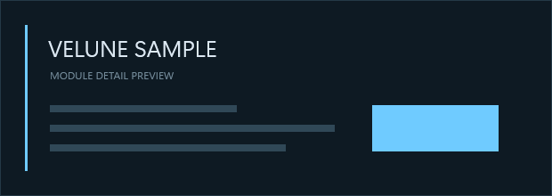

# VELUNE Module Sample

External boundary proof module for VELUNE Platform 1.0.

References:
- Velune.Module.Abstractions
- Velune.UI

The project intentionally does not reference Velune.Module.Runtime,
Velune.DesignLab, or Velune.Platform.Windows.

Contributions:
- Rail: sample.rail
- Surface: sample.surface / sample.main
- Command: sample.ping
- Preferred Surface width: 980